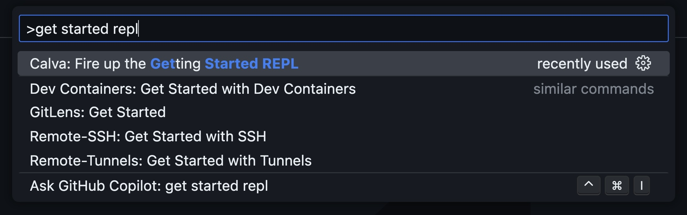

# Calva Clojure IDE setup

### Prerequisites:
- Java
- VS Code

### Install in VS Code:
- **Extensions** pane: Search “Calva”

### Start a standalone REPL:
1. Open a new VS Code window
2. Command Palette:
   **Calva: Fire up the Getting Started REPL**

**Clojure CLI** (`clojure` and `clj`) needed for `deps.edn` projects - [clojure.org/guides/install_clojure](https://clojure.org/guides/install_clojure)
`brew install clojure/tools/clojure`

