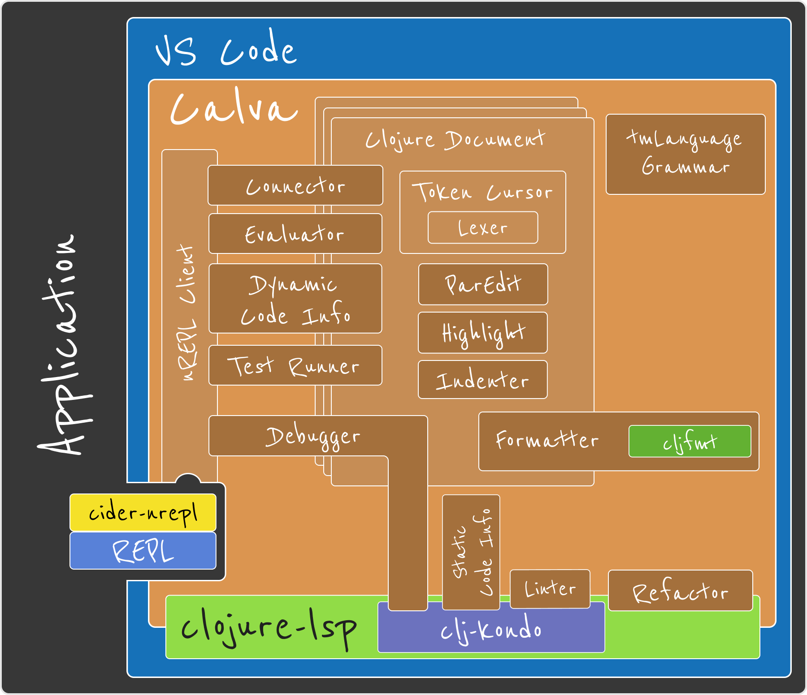

# 

Released March 16 2018  🎉

## ❤️ VS Code and Clojure ❤️

* **Interactive programming**
  * Connects the editor to the running application's REPL 
* **Getting Started REPL**
  https://calva.io/getting-started
* **Structural editing** {([(((♥️)))])}
* Syntax highlight
  * Rainbow 🌈 brackets
  * Structural comments
* Formatting
* Pretty printing
* Code documentation and navigation
  * Including libraries
  * Including Java
* Debugger
* Test runner
* Linter
* Refactoring

  

