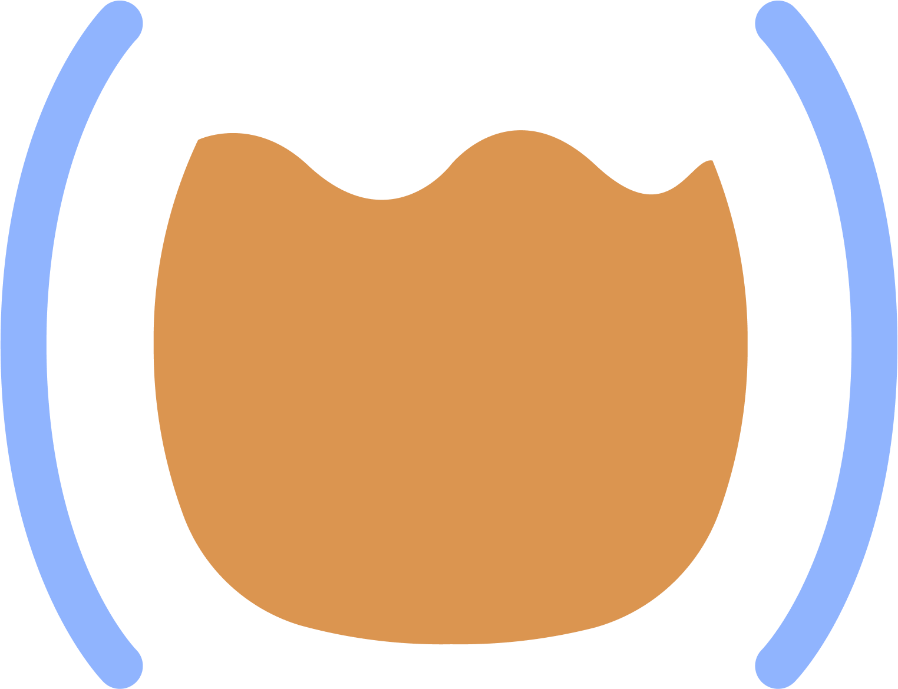

# Give me Interactive Programming, or give me death!

* Peter Strömberg
* Married, five kids.
* Hobbies:
  * Open Source
  * Sharpening kitchen knives 

* https://github.com/PEZ
* https://x.com/pappapez
* https://www.linkedin.com/in/cospaia/
* https://blog.agical.se/en/authors/peter-stromberg
* https://calva.io/

  

* **100%** Salary
  * **80%** Clojure contractor (well, ClojureScript mostly)
  * **20%** Open Source developer

  

