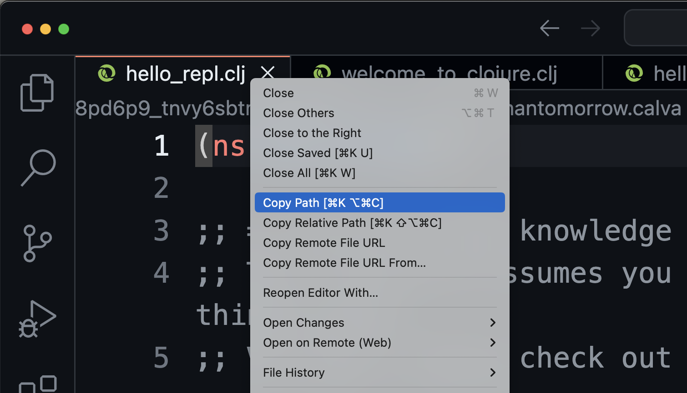

<div class="slide">

# A Minimal Clojure Project
<div class="gutters-10 row">
<div class="column">

- `deps.edn` 
  (containing an empty map `{}`)
- `src/my_app/hello.clj`
  ``` clojure
  (ns my-app.hello)
  ```

</div>

<div class="column">


</div>
</div>

``` sh
~/Projects 
❯ mv /var/.../betterthantomorrow.calva/x6uli/ calva-getting-started-repl

~/Projects 
❯ code calva-getting-started-repl
```
</div>
