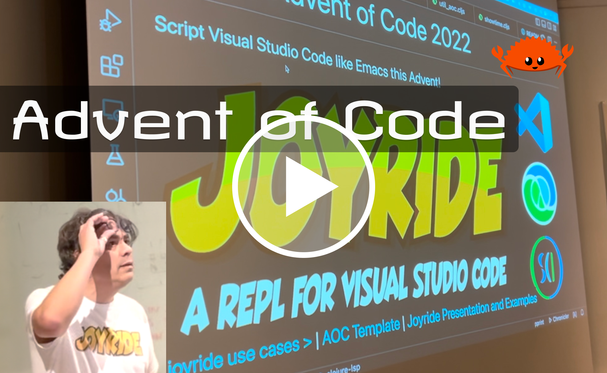

# More Getting Started Resources

- The Getting Started REPL
- Rich4Clojure - editor based exercises
  - https://github.com/PEZ/rich4clojure
- Clojure for the Brave and true
  - https://www.braveclojure.com/
- Functional design in Clojure
  - https://clojuredesign.club/
- Advent of Code
- The full stack example
  - https://github.com/PEZ/cljs-re-frame-full-stack
- Mobile app starter project, React Native
  - https://github.com/PEZ/rn-rf-shadow

https://github.com/PEZ/joyride-aoc-2022

