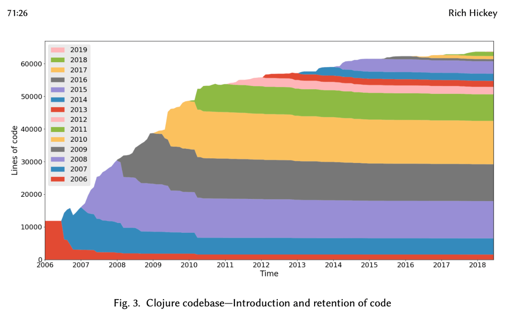
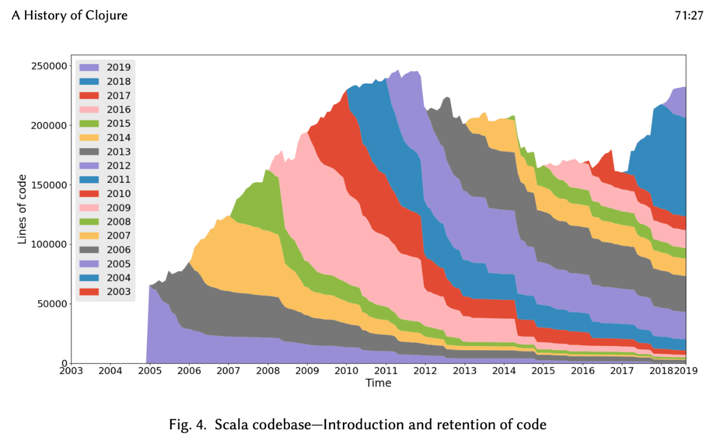

# What's in stability?

It can be a philosophy. Features are added, not changed.
It's a culture, spanning the whole ecosystem.

  

    Clojure
    
  

  

    Scala
    
  

Clojure was released March 2007.

 